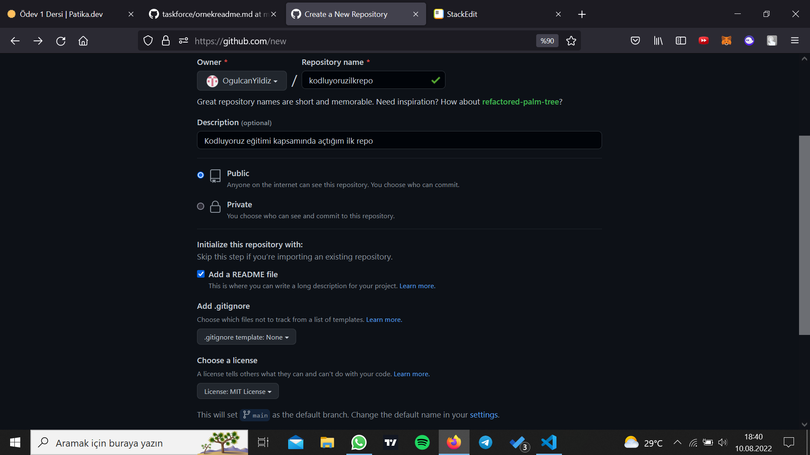

# Kodluyoruz Ilk Repo

Kodluyoruz eğitimi kapsamında açtığım ilk repo. İçerisinde bir adet README dosyasyı, bir adet de index.html barındırıyor.

## Installation

Öncelikle projeyi clonelayın.(https://github.com/OgulcanYildiz/kodluyoruzilkrepo.git)

## Usage
Projeyi cloneladıktan sonra Visual Studio Code programında açınız. 

Linux için:

 > cd kodluyoruzilkrepo
 >
 >code .

 ## Contributing

 Pull requestler kabul edilir.Büyük değişiklikler için,lütfen neyi değiştirmek istediğinizi tartışmak için konu açınız.

 ## License
 
  [MIT](https://choosealicense.com/licenses/mit/)